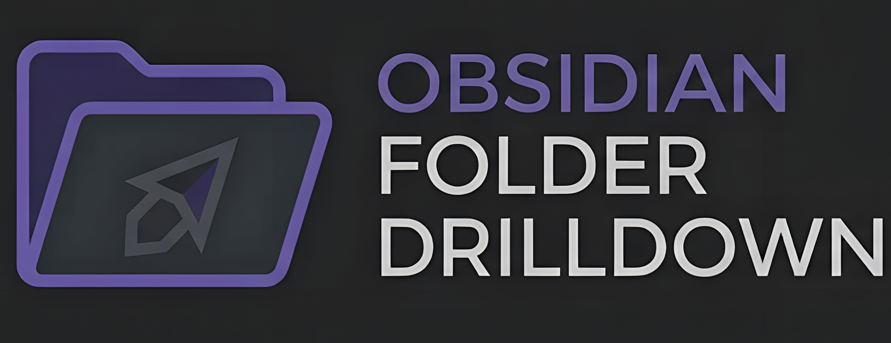

# Obsidian Folder Drilldown

  

A plugin for Obsidian that allows you to "drill down" into folders in the file explorer, making a specific folder act as the root of your view.

## Features

- **Focus Mode:** Double-click any folder to isolate it. The file explorer will only show the contents of that folder.
- **Clean View:** When entering a folder, all subfolders are automatically collapsed for a tidy workspace.
- **Easy Navigation:**
  - Double-click the focused folder title to go back up.
  - Double-click empty space in the file explorer to go back up.
  - Use the "Go Back" command.
- **Persistence:** Your focus state is saved and restored when you restart Obsidian.

## Installation

### From Community Plugins

1.  Open Obsidian Settings > **Community plugins**.
2.  Turn off **Restricted mode**.
3.  Click **Browse** and search for "Folder Drilldown".
4.  Click **Install** and then **Enable**.

### Manual Installation

1.  Download the latest release from the GitHub repository.
2.  Extract the files into your vault's `.obsidian/plugins/obsidian-folder-drilldown` folder.
3.  Reload Obsidian and enable the plugin in settings.

## Usage

- **Drill Down:** Double-click on any folder in the file explorer.
- **Go Up:** Double-click the title of the currently focused folder, or double-click any empty space in the file explorer pane.
- **Reset:** Use the command palette (`Ctrl/Cmd + P`) and search for "Reset Focus" to return to the vault root.

## Development

1.  Clone the repository.
2.  Run `npm install` to install dependencies.
3.  Run `npm run dev` to start compilation in watch mode.

## License

MIT
